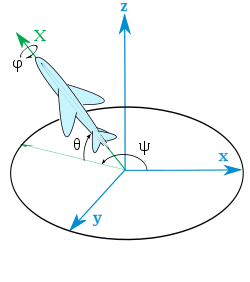

# Mathematical Libraries

## VectorND classes

Vector2D, Vector3D and Vector4D are almost-identical classes representing 2D, 3D and 4D vectors respectively.

#### Constructor(...terms)
Expects N numbers as parameters, and constructs a vector with the terms set as the coordinates.
For 2D, the number of terms is 2, for 3D is 3, for 4D is 4.

#### Prototype.add(other : VectorND) : VectorND
v1.add(v2) returns the result of adding the vectors v1 and v2. v1 and v2 must be of the same dimension.

#### Prototype.sub(other : VectorND) : VectorND
v1.sub(v2) returns the result of subtracting the vectors v2 from v1. v1 and v2 must be of the same dimension.

#### Prototype.component_mult(other : VectorND) : VectorND
v1.add(v2) returns the result of multiplying each coordinate of vectors v1 and v2 separately. v1 and v2 must be of the 
same dimension.

#### Prototype.dot(other : VectorND) : Number
v1.dot(v2) returns the result of multiplying each coordinate of vectors v1 and v2 separately, and then adding up all the
terms. v1 and v2 must be of the same dimension.

#### Prototype.scale(scalar : Number) : VectorND
v.scale(a) returns the result of scaling v by a.

#### Prototype.normalize() : Void
v.normalize() changes v so that the magnitude of v is 1.
This works only if the magnitude of v is not zero.

#### Prototype.copy() : VectorND
v.copy() returns a copy of v.

#### (getter) Prototype.magnitude : Number
v.magnitude returns the magnitude (or Euclidean length) of v.

#### (getter) Prototype.magnitude_squared : Number
v.magnitude_squared returns the magnitude (or Euclidean length) of v squared. 
Is slightly more efficient than v.magnitude.

#### (getter) Prototype.normalized : VectorND
v.normalized returns a vector in the same direction as v, but of unit length.

#### (Vector2D) Prototype.cross(other : Vector2D) : Number
v1.cross(v2) returns v1.x * v2.y - v2.x * v1.y

Can be thought of as the magnitude of the cross product of these two vectors if an extra zero component was added to 
them.

#### (Vector3D) Prototype.cross(other : Vector3D) : Vector3D
v1.cross(v2) returns the cross product of vectors v1 and v2.

## Quaternion class
Quaternions are an extension of complex numbers defined such that:

$$i^2 = j^2 = k^2 = ijk = -1$$

Every quaternion can be written as:

$$w + xi + yj + zk$$

With $w$, $x$, $y$ and $z$ being real components.

They're used for efficiently expressing rotations.

#### Constructor(w : Number, x : Number, y : Number, z : Number)
Constructs the quaternion:

$$w + xi + yj + zk$$

If no parameters are given, the quaternion "1" will be constructed. This trivial quaternion represents no rotation.

#### Prototype.add(other : Quaternion) : Quaternion
q1.add(q2) returns the quaternion resulting of adding the two.

#### Prototype.sub(other : Quaternion) : Quaternion
q1.sub(q2) returns the quaternion resulting of subtracting q2 from q1.

#### Prototype.mult(other : Quaternion) : Quaternion
q1.mult(q2) returns the quaternion resulting of multiplying q1 * q2.

#### Prototype.rotate(vector : Vector3D) : Vector3D
If the quaternion q is unitary, q.rotate(v) will return the vector v rotated by the quaternion q.

#### Prototype.copy() : Quaternion
q.copy() returns a copy of q.

#### (getter) Prototype.inverse : Quaternion
q.inverse is the quaternion q' such that q * q' = q' * q = 1

#### (getter) Prototype.conjugate : Quaternion
q.conjugate is the quaternion q' such that q * q' = q' * q = M^2, with M being the magnitude of the quaternion q.

#### (getter) Prototype.elements : Array[Number]
q.elements returns the array [w, x, y, z] of components of q.

#### (getter) Prototype.rotation_matrix : Array[Number]
q.rotation_matrix returns an array of length 9 representing a 3x3 orthogonal matrix with determinant 1 (aka, a rotation
matrix), such that when applying this matrix to some vector v the resulting rotation would be equivalent to just having 
applied the quaternion rotation.

#### Quaternion.fromAxisAndAngle(vector : Vector3D, angle : Number) : Quaternion
Quaternion.fromAxisAndAngle(v, a) returns the quaternion representing the rotation of space around vector v by some 
angle a.

#### Quaternion.fromEulerAngles = function(theta : Number, psi : Number, phi : Number) : Quaternion
Quaternion.fromEulerAngles(theta, psi, phi) returns the quaternion representing the rotation of space according to the
Euler angle description of it.

## LinearTransform class
Objects of this class describe 4-dimensional linear transformations.
For most applications, these 4-dimensional linear transformations will represent either 3-dimensional affine
transformations or projective transformations in projective space.

The linear transformations are split into different types, these types being TS or ST transformations 
(Scale-then-Translation or vice-versa), TRS (Scale-then-Rotation-then-Translation), SRT 
(Translation-then-Rotation-then-Scale) or Unknown (some arbitrary transformation).

#### Constructor(pos_or_matrix, scale, rotation, type)
Type must specify which kind of transform it is (TS, ST, TRS, SRT or Unknown). The default value is "Inferred", and the
method will guess what type you're defining.

If the type is TS, the first two parameters must be Vector3D objects. The resulting transform will be the result of
first scaling by the second parameter and then translating by the first. If the type is ST, the order is reversed.

If the type is TRS, the first two parameters must be Vector3D objects, and the third one must be a Quaternion object
representing a rotation. The resulting transform will be the result of first scaling by the second parameter, then
rotating by the third and then translating by the first. If the type is SRT, the order is reversed.

If the type is Unknown, the first parameter must be a 16-length number array representing a 4x4 matrix. All the other
arguments are ignored.

#### Prototype.mult(other : LinearTransform)
T1.mult(T2) returns the equivalent transform to T1 * T2 when T1 and T2 are thought of as matrices.

In other words, T1.mult(T2) returns the transform resulting of first applying T2 and then applying T1.

#### Prototype.apply(vector : Vector3D | Vector4D)
T.apply(v) returns the result of applying transform T over vector v.

If v is a Vector3D, an extra 1 component will be appended at the end.

#### Prototype.copy()
T.copy() returns a copy of T.